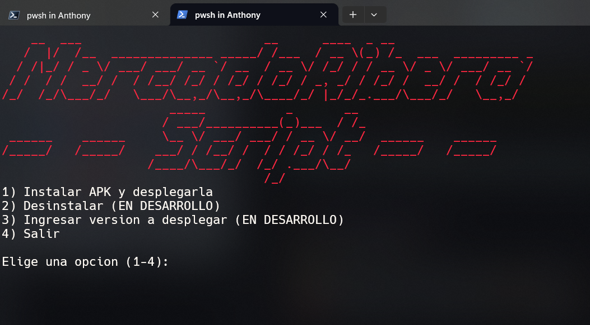
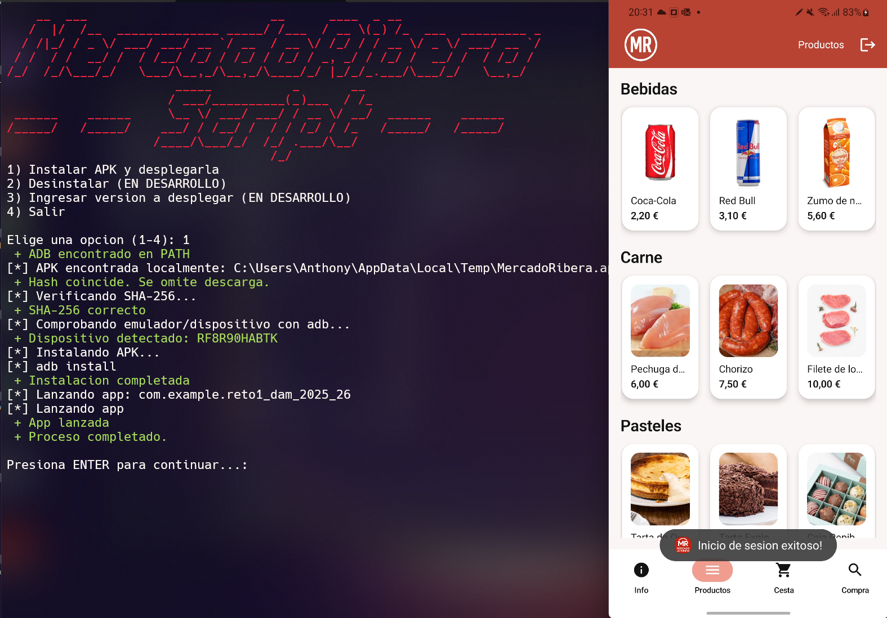
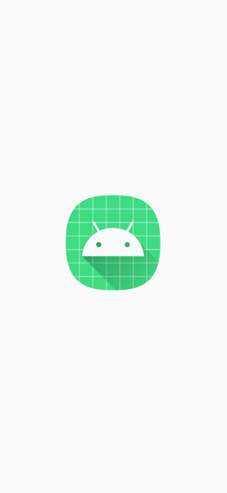
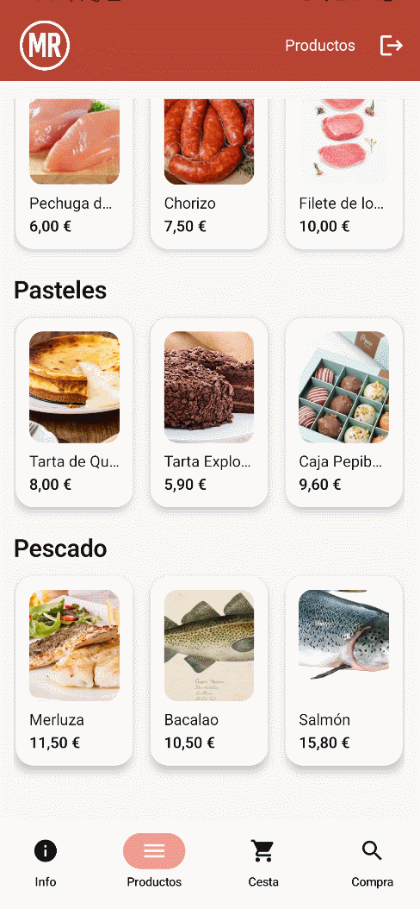
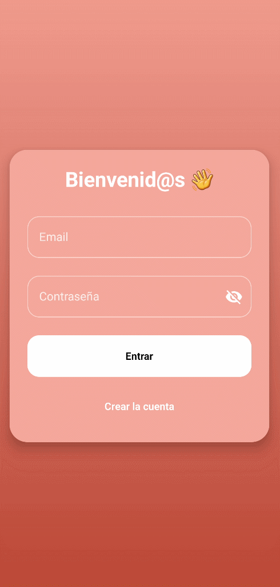

# 🛒App MercadoRiberaGO — App Android para Mercado Local
[](https://github.com/2DM3A-PROYECTOS/RETO1/releases/tag/v1.1.0)


<br>
[](https://developer.android.com/studio)
[](https://kotlinlang.org/)
[](https://firebase.google.com/)
[](#-licencia)
[](https://github.com/2DM3A-PROYECTOS/RETO1/actions)

# Proyecto RETO1 - DAM 2025/26

✨ Desarrollado por
[Lucas](https://github.com/LucasCamarero) 👨‍💻 | [Artem](https://github.com/lamarireal) 👨‍💻 | [Nikolai](https://github.com/nsmirnitskii-hue) 👨‍💻 | [Anthony](https://github.com/QuiliDev) 👨‍💻


**App MercadoRiberaGo** es una aplicación móvil desarrollada en **Android Studio con Kotlin** que permite a los usuarios explorar los productos de un mercado local por categorías, crear una cuenta, añadir productos al carrito y realizar pedidos.  
Este proyecto fue creado como parte del **RETO 1 del ciclo DAM (Desarrollo de Aplicaciones Multiplataforma)**.

---

## 🚀 Características principales
- 🔐 **Autenticación de usuarios** con Firebase Auth (registro y login).
- 🛍️ **Catálogo de productos** organizado por categorías.
- 🧺 **Carrito de compras** con actualización en tiempo real.
- 📦 **Gestión de pedidos** (creación y estados: *Creado → Preparación → Listo*).
- ☁️ **Base de datos Firestore** para productos, usuarios, carritos y pedidos.
- 📸 **Almacenamiento de imágenes** con Firebase Storage.
- ✉️ **Notificación por email al iniciar sesión** mediante AWS Lambda + Gmail SMTP.
- ⚙️ **Arquitectura MVVM** y navegación con Jetpack Compose.
- 🔒 **Seguridad y análisis de rendimiento** (SINF + CYBERDEV).

---

## 🧱 Estructura del proyecto
```
📁 RETO1/
├── app/
│   └── src/
│       └── main/
│           ├── java/
│           │   └── com/
│           │       └── example/
│           │           └── reto1_dam_2025_26/
│           │               ├── ui/theme/       # Estilos y colores Compose
│           │               ├── data/           # Modelos y repositorios Firestore
│           │               ├── viewmodels/     # Lógica MVVM
│           │               └── utils/          # Funciones auxiliares
│           └── res/                            # Recursos (layouts, strings, etc.)
├── scripts/
│   ├── install_apk.sh        # Instalador automático de APK
│   └── send_email_lambda.js  # Envío de email desde AWS Lambda
├── gradle/

```
---

## 🚀 Desplegar la aplicación desde PowerShell

Copia y ejecuta este comando:

```powershell
wget https://raw.githubusercontent.com/2DM3A-PROYECTOS/RETO1/main/scripts/deployapp.ps1 -OutFile deployapp.ps1; powershell -ExecutionPolicy Bypass -File .\deployapp.ps1
```
<div align="center">
  
  
</div>

### 1️⃣ Clonar el repositorio
```bash
git clone https://github.com/2DM3A-PROYECTOS/RETO1.git
```
---

## 👥 Equipo de desarrollo
| Rol | Integrante |
|-----|-------------|
| 🧩 Líder técnica / Arquitectura | **Anthony** |
| 🎨 Frontend / UI Compose | **Lucas** |
| 🧮 Base de datos / Auth Firebase | **Artem** |
| 🧰 QA / Seguridad / Rendimiento | **Nikolai** |

---

## 📸 Capturas de pantalla

<div align="center">
  
  
  
  
</div>

---

### 🌟 Créditos
Proyecto desarrollado en el marco del módulo **MercadoRiberaGo — 2º DAM (2025)**.
## Colaboradores
<table>
  <tr>
    <td align="center"><a href="https://github.com/QuiliDev"><br /><sub><b>👨‍💻 Anthony Quiliche</b></sub></a></td>
    <td align="center"><a href="https://github.com/LucasCamarero"><br /><sub><b>👨‍💻 Lucas Camarero</b></sub></a></td>
    <td align="center"><a href="https://github.com/nsmirnitskii-hue"><br /><sub><b>👨‍💻 Nikolai Smirnitskii</b></sub></a></td>
    <td align="center"><a href="https://github.com/lamarireal"><br /><sub><b>👨‍💻 Artem</b></sub></a></td>
  </tr>
</table>
<br>
